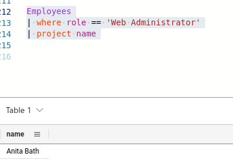

# Welcome to Valdoria !

1. What is the Newspaper Printer's Name?

&#x20;      Ans: Clark Kent&#x20;

2.

<details>

<summary>Next, you talk with <code>Clark Kent</code>. He seems very distressed about the whole situation. 😓 He tells you he simply printed the article that was emailed to him, as he always does.</summary>

now let's write KQL where role == "Editorial Intern"

```aql
// Some code

Employees 
| where role == "Editorial Intern" 
```

result will be&#x20;



Ans : &#x20;

```json
Ronnie McLovin
```

</details>

3.  **When was the Editorial Intern hired at The Valdorian Times?**

    \
    looking at the above KQL result there is column name hire\_date.&#x20;

Ans : &#x20;

```json
2024-01-02T08:00:00Z
```

